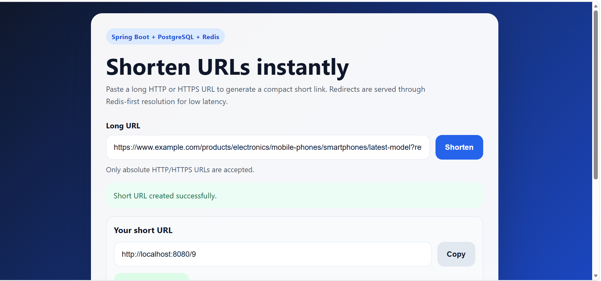

# Redis-Cached URL Shortener

Production-ready URL shortener built with **Spring Boot**, **PostgreSQL**, and **Redis**.
## Output


## Features

- Shorten long URLs with deterministic **Base62** encoding
- Redirect using low-latency **Redis first**, then **PostgreSQL fallback**
- URL validation for **HTTP/HTTPS only**
- Global exception handling with consistent error responses
- Health checks via `GET /actuator/health`
- Simple browser UI served from `/`
- Dockerized app + PostgreSQL + Redis setup

## Project Structure

```text
src/
  main/
    java/com/urlshortner/
      config/
      controller/
      dto/
      entity/
      exception/
      repository/
      service/
      util/
    resources/
      application.yml
      schema.sql
      static/
        index.html
        styles.css
        app.js
  test/
    java/com/urlshortner/
Dockerfile
docker-compose.yml
docker/postgres/init/01-schema.sql
pom.xml
```

## Browser UI

Open the application root in your browser:

```text
http://localhost:8080/
```

The UI lets you paste a long URL, call the existing `POST /shorten` API, copy the generated short URL, and open either the short or original link.

## API

### Create Short URL

`POST /shorten`

Request:

```json
{
  "fullUrl": "https://example.com/some/long/path"
}
```

Response:

```json
{
  "shortUrl": "http://localhost:8080/abc123"
}
```

### Redirect

`GET /{shortCode}`

Behavior:
1. Check Redis cache
2. On hit, redirect immediately
3. On miss, query PostgreSQL
4. Store in Redis
5. Redirect to the original URL

### Health Check

`GET /actuator/health`

## Base62 Strategy

The service uses the PostgreSQL-generated numeric identifier as the source of truth:

1. Allocate the next database id from PostgreSQL
2. Encode the id using Base62
3. Persist `original_url + short_code`
4. Warm Redis with `shortCode -> originalUrl`

Alphabet:

```text
0123456789abcdefghijklmnopqrstuvwxyzABCDEFGHIJKLMNOPQRSTUVWXYZ
```

## Run with Docker Compose

```bash
docker compose up --build
```

Once everything is healthy:

- API: `http://localhost:8080`
- Health: `http://localhost:8080/actuator/health`
- PostgreSQL: `localhost:5432`
- Redis: `localhost:6379`

## Run Locally

### 1) Start PostgreSQL and Redis

You can use Docker just for the dependencies:

```bash
docker compose up postgres redis
```

### 2) Start the Spring Boot app

```bash
mvn spring-boot:run
```

## Example Requests

Create a short URL:

```bash
curl -X POST http://localhost:8080/shorten \
  -H "Content-Type: application/json" \
  -d '{"fullUrl":"https://example.com/some/long/path"}'
```

Follow the redirect:

```bash
curl -i http://localhost:8080/1
```

Check health:

```bash
curl http://localhost:8080/actuator/health
```

## Configuration

Environment variables supported by `application.yml`:

- `SPRING_DATASOURCE_URL`
- `SPRING_DATASOURCE_USERNAME`
- `SPRING_DATASOURCE_PASSWORD`
- `SPRING_DATA_REDIS_HOST`
- `SPRING_DATA_REDIS_PORT`
- `APP_BASE_URL`
- `APP_CACHE_TTL_SECONDS` (default `86400`)

## Error Response Shape

```json
{
  "error": "Only HTTP and HTTPS URLs are supported",
  "status": 400,
  "timestamp": "2026-06-28T12:00:00Z"
}
```
